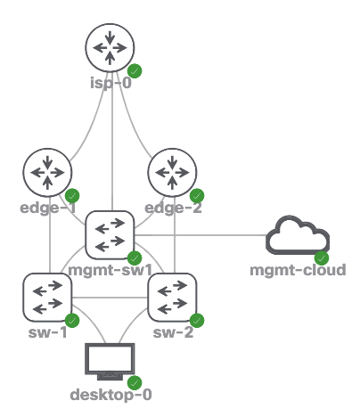

## Getting Started

For this repository/webinar a simple topology was created and looks like the below image:



## Pre-change Validation Steps

1. Ansible is used to generate configuration via Jinja2 templates.
2. A docker-compose with `invoke` is provided to demonstrate a local pipeline testing.
3. Update `vars` files based on required changes.

### Create Virtual Environment and Install

```bash
cd webinars/batfish-routing
```

```bash
poetry shell
```

```bash
poetry install
```

## Running the Pipeline (locally)

```
invoke tests
```

Invoke test will build two docker containers. One with this `application` and the other is `batfish` itself.

## Invoke Tests In Action

*What does invoke tests do?*

1. Bring up containers.
2. Generates the configurations.
3. Run `tests`.

```
▶ invoke tests
Running docker-compose command "ps --services --filter status=running"
Running docker-compose command "run --entrypoint 'yamllint .' batfish-routing"
[dim]PYTHON_VER=3.9 \
    docker-compose \
    --project-name "batfish_routing" \
    --project-directory "/Users/jeffkala/2022-ntc-content/webinars/batfish-routing/development/" \
    -f "/Users/jeffkala/2022-ntc-content/webinars/batfish-routing/development/docker-compose.yml" \
    run --entrypoint 'yamllint .' batfish-routing[/dim]
Creating batfish_routing_batfish-routing_run ... done
Running docker-compose command "ps --services --filter status=running"
Running docker-compose command "run --entrypoint 'ansible-playbook /local/config_gen/pb_generate_configs.yml -i /local/config_gen/inventory.yml' batfish-routing"
[dim]PYTHON_VER=3.9 \
    docker-compose \
    --project-name "batfish_routing" \
    --project-directory "/Users/jeffkala/2022-ntc-content/webinars/batfish-routing/development/" \
    -f "/Users/jeffkala/2022-ntc-content/webinars/batfish-routing/development/docker-compose.yml" \
    run --entrypoint 'ansible-playbook /local/config_gen/pb_generate_configs.yml -i /local/config_gen/inventory.yml' batfish-routing[/dim]
Creating batfish_routing_batfish-routing_run ... done

PLAY [10000 - GENERATE CONFIGURATIONS] *********************************************************************************************************************************************************************

TASK [10010 - GENERATE CONFIGURATIONS] *********************************************************************************************************************************************************************
ok: [edge-1]
ok: [sw-1]
ok: [edge-2]
ok: [sw-2]
ok: [isp-0]

PLAY RECAP *************************************************************************************************************************************************************************************************
edge-1                     : ok=1    changed=0    unreachable=0    failed=0    skipped=0    rescued=0    ignored=0   
edge-2                     : ok=1    changed=0    unreachable=0    failed=0    skipped=0    rescued=0    ignored=0   
isp-0                      : ok=1    changed=0    unreachable=0    failed=0    skipped=0    rescued=0    ignored=0   
sw-1                       : ok=1    changed=0    unreachable=0    failed=0    skipped=0    rescued=0    ignored=0   
sw-2                       : ok=1    changed=0    unreachable=0    failed=0    skipped=0    rescued=0    ignored=0   

Running docker-compose command "ps --services --filter status=running"
Running docker-compose command "run --entrypoint 'python /local/config_gen/tests/test_routing.py' batfish-routing"
[dim]PYTHON_VER=3.9 \
    docker-compose \
    --project-name "batfish_routing" \
    --project-directory "/Users/jeffkala/2022-ntc-content/webinars/batfish-routing/development/" \
    -f "/Users/jeffkala/2022-ntc-content/webinars/batfish-routing/development/docker-compose.yml" \
    run --entrypoint 'python /local/config_gen/tests/test_routing.py' batfish-routing[/dim]
Creating batfish_routing_batfish-routing_run ... done
Your snapshot was successfully initialized but Batfish failed to fully recognized some lines in one or more input files. Some unrecognized configuration lines are not uncommon for new networks, and it is often fine to proceed with further analysis. You can help the Batfish developers improve support for your network by running:

    bf.upload_diagnostics(dry_run=False, contact_info='<optional email address>')

to share private, anonymized information. For more information, see the documentation with:

    help(bf.upload_diagnostics)
====================
Starting Batfish Setup.....
====================
Validated Assert No Unestablished Bgp Sessions
Validated Assert No Incompatible Bgp Sessions
Validated Assert No Incompatible Ospf Sessions
Test from @enter(sw-1[GigabitEthernet0/0]) to DNS has passed!
Test from @enter(sw-2[GigabitEthernet0/0]) to DNS has passed!
/usr/local/lib/python3.9/site-packages/pybatfish/client/asserts.py:224: BatfishAssertWarning: No node: sw-1
  warnings.warn("No node: {}".format(node), category=BatfishAssertWarning)
Desktop pod has no routes to security servers. passed!
Route to DNS must be a OSPF E2 route from Desktop pod. passed!
There is always at least one BGP session towards an ISP in Established state. passed!
All tests have passed!
```

